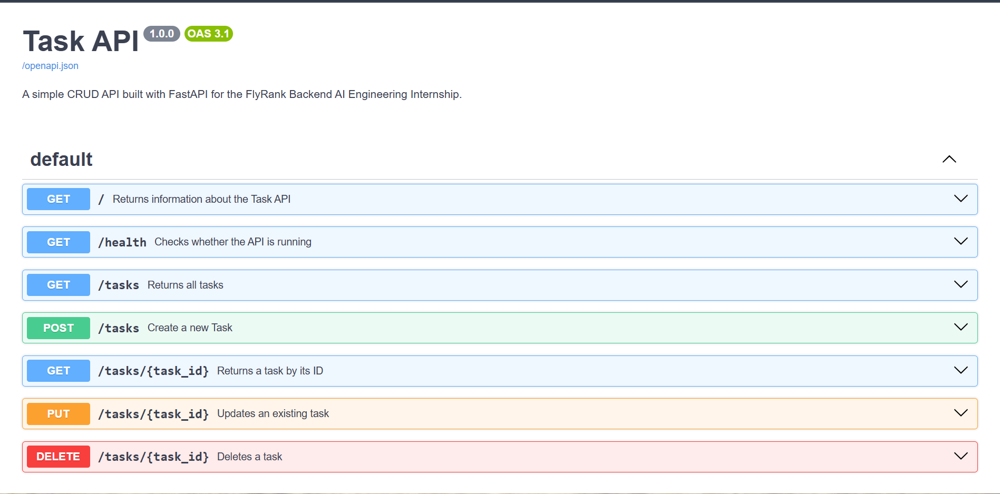

# Task API

A simple REST API built with FastAPI as part of the FlyRank Backend AI Engineering Internship.

## Prerequisites

* Python 3.x
* FastAPI
* Uvicorn

---

## Setup

### Clone the repository

```bash
git clone <your-repository-url>
cd task-api
```

### Create a virtual environment

```bash
python -m venv .venv
```

### Activate it (Windows)

```bash
.venv\Scripts\activate
```

### Install dependencies

```bash
pip install -r requirements.txt
```

### Run the server

```bash
uvicorn main:app --reload
```

Server:

```
http://localhost:8000
```

Swagger UI:

```
http://localhost:8000/docs
```

---

## Available Endpoints

| Method | Endpoint           | Description                          |
| ------ | ------------------ | ------------------------------------ |
| GET    | `/`                | Returns API information              |
| GET    | `/health`          | Checks if the server is running      |
| GET    | `/tasks`           | Returns all tasks                    |
| GET    | `/tasks/{task_id}` | Returns a task by ID                 |
| POST   | `/tasks`           | Creates a new task                   |
| PUT    | `/tasks/{task_id}` | Updates a task                       |
| DELETE | `/tasks/{task_id}` | Deletes a task                       |
| GET    | `/stats`           | Returns task statistics              |
| POST   | `/reset`           | Resets the tasks to the initial list |

### Query Parameters

The `/tasks` endpoint supports optional query parameters for filtering and searching.

```text
/tasks?done=true
/tasks?done=false
/tasks?search=work
/tasks?done=false&search=work
```

* `done` filters tasks based on their completion status.
* `search` searches for text within task titles.
* Both parameters can be used together.

---

## Testing

You can test the API using:

* Browser
* Swagger UI
* curl

Example:

```bash
curl.exe -i http://localhost:8000/tasks
```

---

## Swagger UI

Swagger UI is automatically generated by FastAPI and provides interactive API documentation.

Open:

```
http://localhost:8000/docs
```

## Swagger UI Preview

The following screenshot shows the automatically generated Swagger UI for the Task API.



---

## In-Memory Storage Experiment

The API currently stores tasks in an in-memory Python list.

After creating new tasks, stopping the server and starting it again causes the newly created tasks to disappear. This happens because the data is stored only in memory and is not persisted when the server process stops.

---

## AI vs. Developer: What I Learned

During development, I compared my hand-written FastAPI implementation with an AI-generated production version to understand how enterprise APIs are structured.

| Topic              | My Implementation                                                  | AI / Enterprise Pattern                                                          | Takeaway                                                                                               |
| :----------------- | :----------------------------------------------------------------- | :------------------------------------------------------------------------------- | :----------------------------------------------------------------------------------------------------- |
| **Validation**     | Checked empty strings manually using `if/else` inside route logic. | Defined rules directly inside Pydantic models using `Field(min_length=1)`.       | **Automate validation:** Pydantic catches bad data before it reaches endpoint logic.                   |
| **Response Types** | Returned raw Python dictionaries directly from route functions.    | Used explicit `response_model=TaskOut` on endpoints.                             | **Protect output:** Response models sanitize outgoing data and document Swagger schemas automatically. |
| **Route Ordering** | Handled routes as they were created.                               | Placed static routes (`/tasks/stats`) above path variables (`/tasks/{task_id}`). | **Routing logic:** FastAPI reads top-to-bottom; static paths must come before wildcard dynamic paths.  |

**Key Takeaway:** AI excels at rapidly generating standard boilerplate and schema tags, but understanding core HTTP methods, routing mechanisms, and business logic is what makes an effective developer.

---

## Stage 7 — AI Rematch

As an optional Stage 7 exercise, I asked an AI assistant to build the same FastAPI CRUD API based on a prompt that I wrote myself. I kept the AI-generated implementation separate from my hand-written implementation and compared both versions.

### My Prompt to the AI

This is the prompt I gave to the AI:

```text
You are a professional Backend enginner your task is to design a 
Full CRUD API on FAST API framework
Goal : Build a small API that manages a to-do list : you can create task, read them , update them and delete them , the four CRUD operations . Also create a Swagger UI page that you would test it there with proper summary .
Tools : Python
Framework : Fast API
Create a Virtual Environment.
Add a README That would contain how to run the application
your data lives only in memory no Database yet.
Steps : 
First add a endpoint Get that would describes your API returns JSON
{ "name": "Task API", "version": "1.0", "endpoints": ["/tasks"] }
Add Get /health that would check if the server is alive 
After that create a in-memory list of tasks that would contains 3 exmaple tasks Each task would have id(number) , title(text) and done(bool)
then display all the tasks using get /tasks
after that also add other endpoints like return task by id 
and return error 404 if no task exists.
Then creat a post task endpoint that would create a new task only title is sent and task is created while the id is generated automatically new one according to the task list and also the done status should be false 
if title is missign return error 
than also add update and delete endpoints with proper validation and error handling if any thing bad happens 
then set the swaggger ui with proepr summary 
also for tasks also add query endpoints like filter with title and status 
also add a stats endpoint that shows the total, done and open tasks
also add a post reset that would restore the 3 example tasks in the list 
Requirement:
server starts with one command
Full CRUD operations performed 
Correct status codes 200 reads, 201 create, 204 delete, 400 invalid body, 404 unknown id each error with a correct error message 
Post and Put validate the input 
Swagger UI lists every endpoint 
this is the pormpt
```

### Additional Requirements I Added

In addition to the basic CRUD requirements, I specifically asked the AI to include:

* Query parameters for filtering tasks by status.
* Query parameters for searching tasks by title.
* A `/stats` endpoint showing total, done, and open tasks.
* A `/reset` endpoint to restore the original three example tasks.
* Proper summaries for the Swagger UI endpoints.
* Validation and error handling for POST and PUT requests.
* Correct HTTP status codes for successful and failed operations.

These requirements allowed me to compare the AI implementation with my own implementation beyond just the basic CRUD operations.

### AI vs. My Implementation

After comparing both implementations, I identified several differences:

| Topic              | My Implementation                                                  | AI / Enterprise Pattern                                                               | What I Learned                                                                                |
| :----------------- | :----------------------------------------------------------------- | :------------------------------------------------------------------------------------ | :-------------------------------------------------------------------------------------------- |
| **Validation**     | Checked empty strings manually using `if/else` inside route logic. | Defined validation rules directly inside Pydantic models using `Field(min_length=1)`. | Pydantic can handle validation before the request reaches the main endpoint logic.            |
| **Response Types** | Returned raw Python dictionaries directly from route functions.    | Used explicit `response_model=TaskOut` on endpoints.                                  | Response models make the API output more controlled and improve the Swagger documentation.    |
| **Route Ordering** | Handled routes as they were created.                               | Placed static routes such as `/tasks/stats` before `/tasks/{task_id}`.                | Static routes should be placed before dynamic path routes so that they are matched correctly. |

### What I Learned

The AI-generated implementation showed me some patterns that are useful when building larger APIs. In particular, Pydantic validation and response models can make API behavior more structured and make the generated Swagger documentation clearer.

At the same time, building my own implementation first helped me understand what the AI-generated code was doing instead of simply accepting the generated code.

The main lesson was that generating code and understanding code are two different skills. AI can generate standard FastAPI patterns quickly, but the developer still needs to understand the HTTP methods, routing, validation, status codes, and business logic.

### Rematch

After comparing the first AI-generated implementation with my own implementation, I refined the requirements by making the filtering, search, statistics, reset functionality, validation rules, status codes, and Swagger requirements explicit.

The rematch showed me that giving an AI more precise requirements makes its implementation closer to the expected behavior.

---

## Current Progress

* ✅ Stage 0: Hello Server
* ✅ Stage 1: Root and Health Endpoints
* ✅ Stage 2: Read Endpoints
* ✅ Stage 3: Create with Validation
* ✅ Stage 4: Full CRUD
* ✅ Stage 5: Swagger UI
* ✅ Stage 6: Pubilsh and docs
* ✅ Stage 7: AI Rematch
* ✅ Extra: Query parameter filtering
* ✅ Extra: Task search
* ✅ Extra: Task statistics
* ✅ Extra: Reset tasks
* ✅ Extra: In-memory storage experiment
